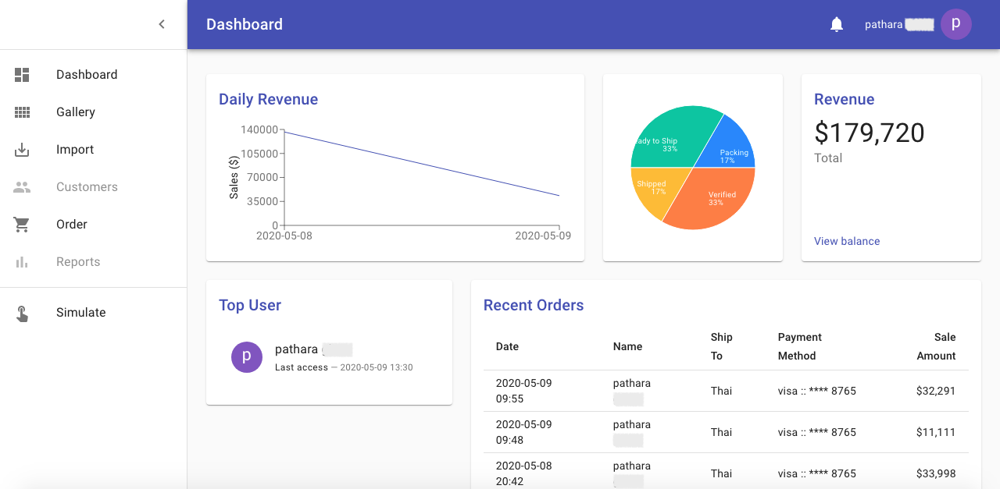
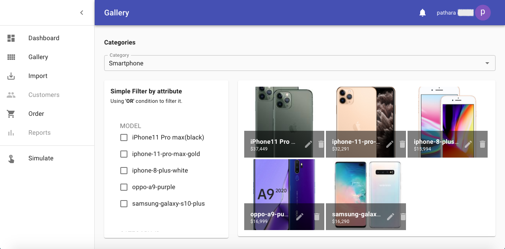
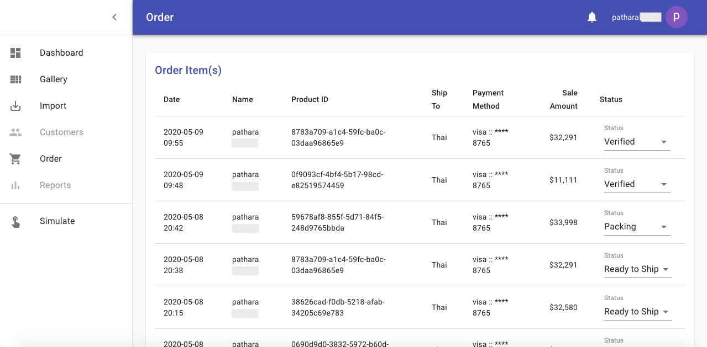
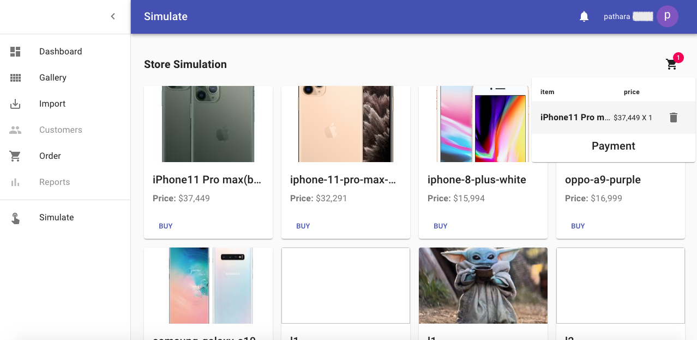

# **eCommAdmin**
[](https://github.com/patharanordev/api-ecomm-gateway)


eCommAdmin is a simple Dockerize monolithic application, handling authentication via Google passportjs with Node.js.

OK, let's buy product in my store simulation [here](https://api-ecomm-gateway.herokuapp.com/simulate).



| Gallery page                           | Order page                           | Store Simulation                        |   
| ------------------------------------ | ------------------------------------ | --------------------------------------- |
|  |  |  |

## **Main Dependencies**

 - `express`
 - `body-parser`
 - `express-session`
 - `cookie-parser`
 - `serve-static`
 - `connect-ensure-login`
 - `passport`, `passport-google-oauth2`
 - `next`, `react`, `redux`
 - `sequelize`

## **Project Structure**

```
project
.
├── components
│   └── [ANY STATELESS COMPONENTS]
├── helper
│   ├── reducer
│   │   └── [ANY REDUCERS OF EACH PAGE IN "*.js" FILE FORMAT]
│   ├── redux-store.js
│   └── RESTFul.js
├── pages
│   └── [ANY STATEFUL PAGE COMPONENTS]
├── public
│   └── images
│       └── [ANY IMAGES IN THE APPLICATION]
├── sequelize
│   ├── apis
│   │   └── database.js
│   ├── models
│   │   └── [ANY DATABASE SCHEMAS]
│   └── db-handler.js
├── src
│   └── theme.js
├── .babelrc
├── .dockerignore
├── .gitignore
├── Dockerfile
├── package.json
├── routes.js
└── server.js
```

## **Google Passport**

### **Set Google strategy to passport**

```js

const GoogleStrategy = require( 'passport-google-oauth2' ).Strategy;

//...

passport.use(new GoogleStrategy({
        clientID: process.env.GOOGLE_APP_ID,
        clientSecret: process.env.GOOGLE_APP_SECRET,
        callbackURL: `${process.env.HOST}/auth/google/callback`, 
        enableProof: true
    },
    function(accessToken, refreshToken, profile, cb) {
        console.log('Access token : ', accessToken);
        console.log('Refresh token : ', refreshToken);
        console.log('Profile : ', profile);
        cb(null, profile)
    }
));
```

### Credential for Google API

To get `GOOGLE_APP_ID` and `GOOGLE_APP_SECRET`, you must login to Google Cloud Platform to create your project first and then the credential. Please refer to this link https://console.developers.google.com/apis/credentials

### **Configure Passport authenticated session persistence**

```js
passport.serializeUser(function(user, cb) {
    cb(null, user);
});
  
passport.deserializeUser(function(obj, cb) {
    cb(null, obj);
});
```

### **Prepare passport session**

```js
app.use(passport.initialize());
app.use(passport.session());
```

## **Custom API**

**Create simple auth endpoint**

```js
// Calling API without auth via POST method
server.post('/api/v1/:name', (req, res) => {
    // Handle APIs here
});

// ----- Set auth with Passport.js by using GoogleStrategy -----

// Scope : 
// - https://developers.google.com/identity/protocols/oauth2/scopes
// - https://github.com/mstade/passport-google-oauth2#what-you-will-get-in-profile-response-
server.get('/login/google', 
    passport.authenticate('google', { 
        scope: [ 
            'https://www.googleapis.com/auth/plus.login'
            , 'https://www.googleapis.com/auth/plus.profile.emails.read'
            , 'https://www.googleapis.com/auth/userinfo.email'
        ]
    })
);
server.get('/auth/google/callback',
    passport.authenticate('google', { 
        failureRedirect: '/login/google',
        successRedirect: '/dashboard'
    })
);

// ----- Access admin page with authentication -----

// Calling API with auth
server.post('/api/v1/:name', cslg.ensureLoggedIn('/login/google'), (req, res) => {
    // Handle APIs here
});

// Page access
server.get('/dashboard', cslg.ensureLoggedIn('/login/google'), (req, res) => {
    console.log('in get - user:', req.user);
    return app.render(req, res, '/dashboard', { user:req.user })
})

```

## **Usage**

Simple usage or run on production, I recommended you to use `Dockerize` on `Heroku`. Please see instruction below:

### **Dockerize**

#### **Build process** 

 1. Update `apk` on `node:12.16.1-alpine3.9`
 2. Set `--no-cache` 
 3. Install `openssl`, `tzdata`
 4. Set time zone to `Asia/Bangkok`
 5. Install service dependencies via `npm` 

#### **Build an image**

```bash
$ docker build -t patharanor/api-ecomm-gateway:SPECIAL_TAG .
```
#### **Environment**

 - `GOOGLE_APP_ID` - client ID of your Google App
 - `GOOGLE_APP_SECRET` - client secret of your Google App
 - `HOST` - host/instance that provides the service
 - `PORT` - port number of the service
 - `SESSION_SECRET_KEY` - any word

#### **Run the image**

Bind port to outsite(left) via port number `3000`.

```bash
$ docker run \
-p 3000:3000 \
-e APP_VERSION=0.4.0 \
-e GOOGLE_APP_ID=YOUR_GOOGLE_APP_ID \
-e GOOGLE_APP_SECRET=YOUR_GOOGLE_APP_SECRET \
-e HOST=YOUR_HOST \
-e PORT=3000 \
-e SESSION_SECRET_KEY=YOUR_SESSION_SECRET_KEY \
-e DB_USER=ekx...cc \
-e DB_PASS=90078c...........................fa87e226cd \
-e DB_HOST=ec2...................aws.com \
-e DB_PORT=5432 \
-e DB_NAME=da..........of2 \
patharanor/api-ecomm-gateway:SPECIAL_TAG
```

#### **Push to DockerHub**

Login to DockerHub

```bash
$ docker login
```

Push it
```bash
$ docker push patharanor/api-ecomm-gateway:SPECIAL_TAG
```

#### **Deployment**

**Heroku**

```
$ heroku login
$ heroku container:push web -a api-ecomm-gateway
$ heroku container:release web -a api-ecomm-gateway
```
Checking via `Heroku` logs:
```
$ heroku logs -a api-ecomm-gateway
```

#### **Database**

**Heroku**

I recommended `Postgres` on `Heroku`, see more detail [here](https://www.heroku.com/postgres)

## **License**

MIT

## **Donation**
If this project help you reduce time to develop, you can give me a cup of coffee :) 

[](https://www.paypal.com/cgi-bin/webscr?cmd=_s-xclick&hosted_button_id=A8YE92K9QM7NA)